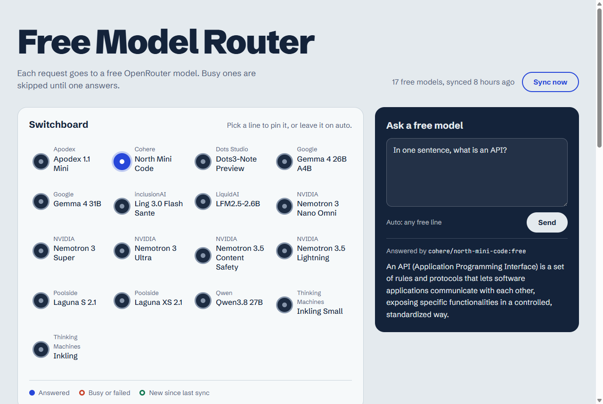

# Free Model Router

A small local server that sends every request to one of [OpenRouter](https://openrouter.ai)'s free models. When a model is rate-limited or down, it moves on to the next one until something answers.

It speaks both the **OpenAI** (`/v1/chat/completions`) and **Anthropic** (`/v1/messages`) APIs, so you can point existing SDKs, tools, or Claude Code at it. A dashboard shows which free models exist right now, what changed since the last sync, and lets you try a prompt.



## Quick start

Requires Python 3.10+ and an [OpenRouter API key](https://openrouter.ai/keys). Free models don't cost anything, but OpenRouter still needs a key.

```bash
git clone https://github.com/<you>/free-model-router.git
cd free-model-router
pip install -e .

export OPENROUTER_API_KEY=sk-or-...      # PowerShell: $env:OPENROUTER_API_KEY="sk-or-..."

free-router sync      # fetch the current list of free models
free-router serve     # http://127.0.0.1:8000
```

## Commands

| Command | What it does |
| --- | --- |
| `free-router sync` | Fetches OpenRouter's model list and saves the free ones to `data/free-models.json`. Each sync is logged in `data/free-model-history.json` (last 90 kept). |
| `free-router serve [--host] [--port] [--reload]` | Runs the router and dashboard, and keeps the model list fresh (see `FREE_ROUTER_SYNC_INTERVAL`). |
| `free-router query "prompt" [--no-sync]` | Syncs, then prints one answer from whichever free model responds first. |

`python -m free_router <command>` is equivalent. Add `-v` to log every model attempt.

## Connecting clients

**OpenAI SDKs**

```python
from openai import OpenAI

client = OpenAI(base_url="http://127.0.0.1:8000/v1", api_key="unused")
reply = client.chat.completions.create(
    model="auto",  # or a specific id such as "qwen/qwen3.8-27b:free"
    messages=[{"role": "user", "content": "Hello"}],
)
```

**Claude Code and Anthropic SDKs**

```bash
export ANTHROPIC_BASE_URL=http://127.0.0.1:8000
export ANTHROPIC_AUTH_TOKEN=unused
```

The requested Claude model name is ignored and a free model is used instead. Tool use is translated in both directions.

With `stream: true`, text is passed on as the model writes it. Each tool call is held back until it's complete and then sent in one piece, so a provider's quirks in streaming tool arguments can't produce broken JSON. During long silences (a model reasoning, or a large tool call being collected) the server sends `ping` events so clients don't time out.

## How routing works

- `model: "auto"` (or no model) tries every free model that can handle the request:
  - **Capability filtering:** models without tool support are skipped for requests with `tools`, text-only models for requests with images, and models whose context is too small for the prompt. If none fit, the request fails with `400` saying why. (This uses metadata saved by `free-router sync`; re-sync after upgrading.)
  - **Health-aware order:** a model that just failed (network error, timeout, `429`, `5xx`) sits out a cooldown that starts at 10s and doubles per consecutive failure, up to 5 minutes. Models that answer reliably are tried earlier, but the order stays randomized so load is spread out. Cooling models are still tried last, so a request is never refused just because everything failed recently.
  - **Output limit:** a `max_tokens` above what a model allows is lowered to fit, so a client asking for 32k tokens isn't rejected by an 8k model.
- A specific model id is tried once, with no fallback. It must be one of the synced free models, so a typo can never send a request to a paid model on your key.
- A non-2xx reply, a network error, a timeout, a non-JSON body or a reply with no choices counts as a miss, and the next model is tried. After a 429 there's a short pause first.
- For streams, a model only counts as answering once it produces output. A stream that errors or ends before any output is a miss like any other, so the next model is tried. An error after output has started can't be retried: it ends the stream (with an `error` event on `/v1/messages`).
- Each request has an overall deadline (10 minutes by default). Each model's timeout is capped by the time left, and once it runs out the request fails with `504` instead of trying more models. For non-streaming requests the deadline covers the whole reply; for streams it covers getting the stream started.
- A malformed request (for example, no `messages`) is rejected with `400` before any model is called.
- Successful responses include `X-Router-Model` (who answered) and `X-Router-Attempts` (who was skipped, with status codes).

## Errors

Errors use the shape each client already understands:

```jsonc
// /v1/chat/completions, /v1/models, /api/*
{"error": {"message": "...", "type": "all_models_failed", "attempts": [...]}}

// /v1/messages
{"type": "error", "error": {"type": "overloaded_error", "message": "..."}}
```

| Status | When |
| --- | --- |
| `400` | Malformed request, or an explicit model that isn't a known free model. |
| `415` | A POST whose `Content-Type` isn't `application/json`. |
| `500` | `OPENROUTER_API_KEY` is missing, or an unexpected bug (details go to the server log, not the client). |
| `502` | A sync couldn't reach OpenRouter. |
| `503` | No models are synced yet, or every model failed. |
| `504` | The request deadline passed before any model answered. |

## API

| Method | Path | |
| --- | --- | --- |
| `POST` | `/v1/chat/completions` | OpenAI-compatible. Supports `stream: true`. |
| `POST` | `/v1/messages` | Anthropic-compatible. Supports `stream: true`. |
| `GET` | `/v1/models` | Free models in OpenAI list format. |
| `GET` | `/` | Dashboard. |
| `GET` | `/health`, `/api/status` | Health check and summary. |
| `GET` | `/api/models`, `/api/history` | Full model details and the sync log. |
| `GET` | `/api/model-health` | Per-model success/failure counts, latency, reliability score and remaining cooldown (in memory, since startup). |
| `POST` | `/api/sync` | Runs a sync. |

## Configuration

| Variable | Default | |
| --- | --- | --- |
| `OPENROUTER_API_KEY` | (required) | Used for all chat requests. |
| `FREE_ROUTER_DATA_DIR` | `./data` | Where the model list and history are stored. |
| `FREE_ROUTER_REQUEST_TIMEOUT` | `300` | Seconds to wait on one model before moving on. |
| `FREE_ROUTER_CONNECT_TIMEOUT` | `10` | Seconds to wait for a connection to OpenRouter. |
| `FREE_ROUTER_REQUEST_DEADLINE` | `600` | Total seconds one request may spend across all models. `0` means no limit. |
| `FREE_ROUTER_MAX_ATTEMPTS` | `0` | Models to try per request. `0` means all of them. |
| `FREE_ROUTER_RATE_LIMIT_DELAY` | `0.5` | Seconds to pause after a 429. |
| `FREE_ROUTER_HISTORY_LIMIT` | `90` | Sync log entries to keep. |
| `FREE_ROUTER_SYNC_INTERVAL` | `21600` (6 hours) | Seconds between automatic syncs while serving. The server also syncs at startup if the last sync is older than this. A failed sync is retried after 5 minutes. `0` turns automatic syncing off. |
| `FREE_ROUTER_ALLOWED_HOSTS` | `127.0.0.1,localhost` | `Host` headers the server answers to. |

## Security

The server has no authentication and makes requests with your OpenRouter key, so it's built to stay on your machine:

- It binds to `127.0.0.1` by default.
- Requests with an unknown `Host` header are refused, which blocks DNS-rebinding attacks from websites you visit.
- POSTs must be `application/json`, which a website can't send cross-origin without a CORS preflight (and the server allows none).
- Only free models can be requested.

To use it from other machines on your network, run `free-router serve --host 0.0.0.0` and set `FREE_ROUTER_ALLOWED_HOSTS` to the address clients will use. Don't expose it to the internet.

## Project layout

```
src/free_router/
  config.py          settings from environment variables
  errors.py          error types and the HTTP status each maps to
  storage.py         JSON files on disk (atomic writes)
  openrouter.py      OpenRouter HTTP client
  sync.py            finds free models and records changes
  autosync.py        background syncing while the server runs
  routing.py         the fallback loop
  sse.py             incremental server-sent-events parser
  capabilities.py    which models can serve a request; output-limit fitting
  health.py          per-model cooldowns and reliability ordering
  query.py           ask one prompt from Python
  cli.py             the `free-router` command
  adapters/
    anthropic.py     Anthropic <-> OpenAI request/response/stream translation
  api/
    app.py           FastAPI app and middleware
    errors.py        OpenAI- and Anthropic-shaped error responses
    headers.py       X-Router-* response headers
    openai.py        /v1/chat/completions, /v1/models
    anthropic.py     /v1/messages
    dashboard.py     dashboard page and /api/* endpoints
  web/               dashboard (plain HTML, CSS, JS)
tests/
```

## Development

```bash
pip install -e ".[dev]"

pytest                               # tests (OpenRouter is mocked)
ruff check . && ruff format --check .
mypy                                 # strict type-checking
```

CI runs all of these on Python 3.10 to 3.13 for every push and pull request.

## License

[MIT](LICENSE)
